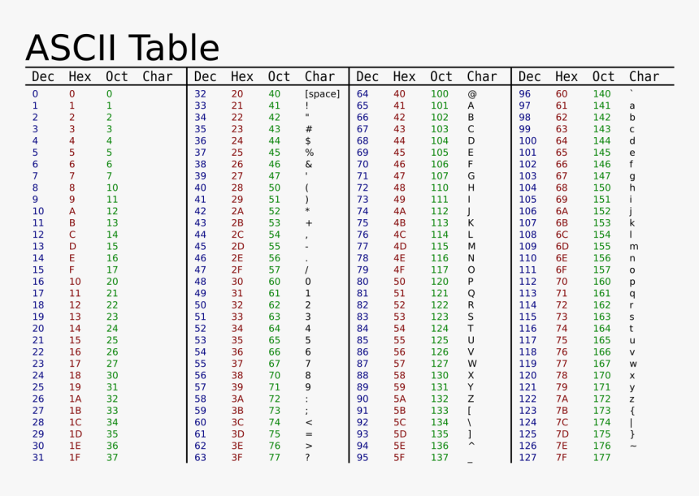

#### Unicode解析
计算机是用来发明解析东西的

###### 4位16进制字符串转为 整数
```c++
// 4位16进制字符转换为一个unsigned int /u0024
// 0000,0000 0000,0000 0000,0000 0000,0000 0000,0000
// 0000,0000 0000,0000 0000,0000 0000,0000 0010,0100 
// 2^5 + 2^2 = 36
const char *LobaJson::LobaParseHex4(const char *p, unsigned int *p_int) {
    *p_int = 0;
    for (int i = 0; i < 4; i++) {
        char ch = *p++;
        *p_int <<= 4;
        if (ch >= '0' && ch <= '9') {
        *p_int |= ch - '0';
        } else if (ch >= 'A' && ch <= 'F') {
        *p_int |= ch - ('A' - 10);
        } else if (ch >= 'a' && ch <= 'f') {
        *p_int |= ch - ('a' - 10);
        } else {
        return nullptr;
        }
    }
    return p;
}
```



###### unicode解析
